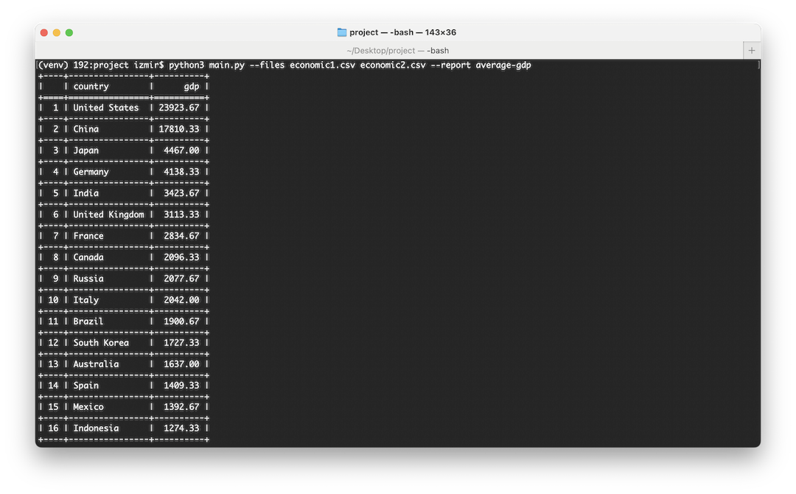

## Запуск
```bash
python -m venv venv            # создать виртуальное окружение
source venv/bin/activate      # активировать (macOS / Linux)
venv\Scripts\activate         # активировать (Windows)
pip install tabulate          # установить библиотеку
python main.py --files economic1.csv economic2.csv --report average-gdp         # запустить скрипт
```


## Добавление нового отчёта

Чтобы добавить новый отчёт, необходимо:

1. Создать новую функцию, которая формирует отчёт.
2. Добавить соответствующее условие в функцию `main()`, чтобы вызывать этот отчёт.

### Пример

```python
def report_new():
    # логика формирования нового отчёта
    
def main():
    # ...

    if args.report == "average-gdp":
        report = build_average_gdp_report(rows)     
    elif report_type == "new-report": # this
        report_new()
    else:
        print(f"Отчет {args.report} не поддерживается.")
        return
    print_report(report)
```

---

Если хочешь, могу сделать более формальную версию для production-проекта 😉
